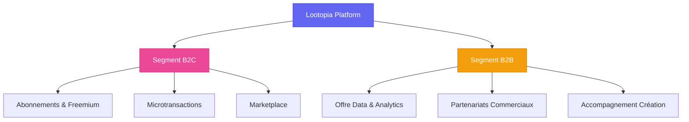
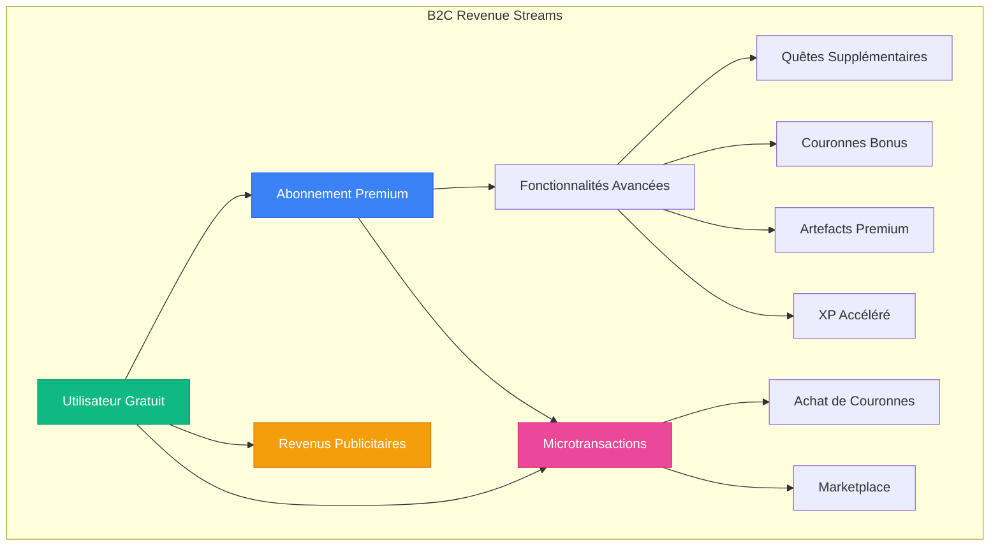
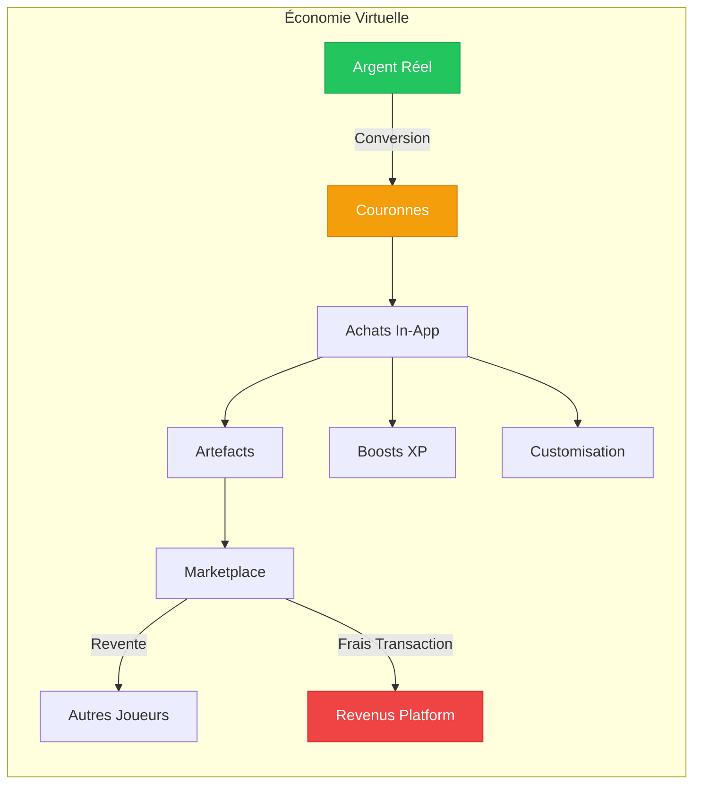
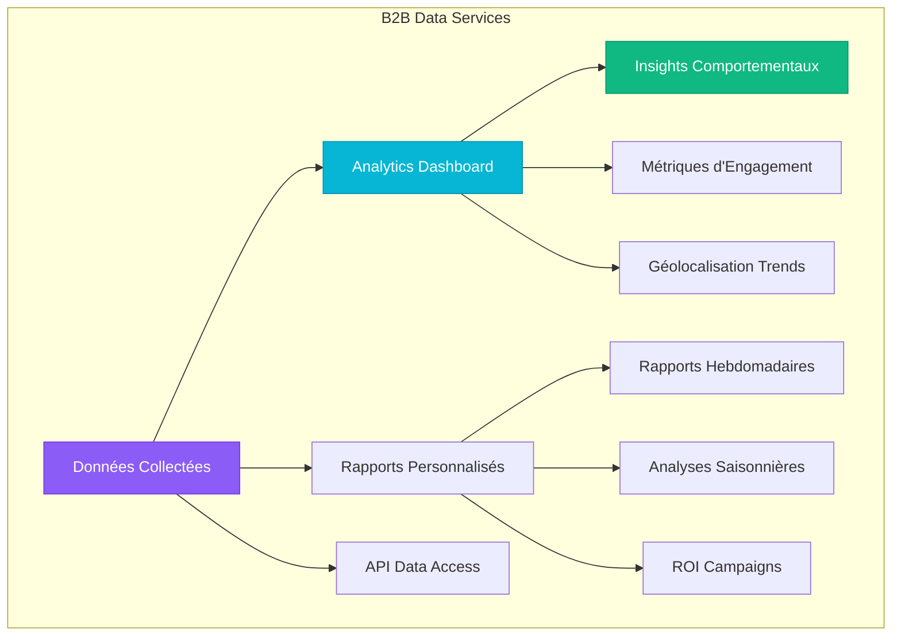
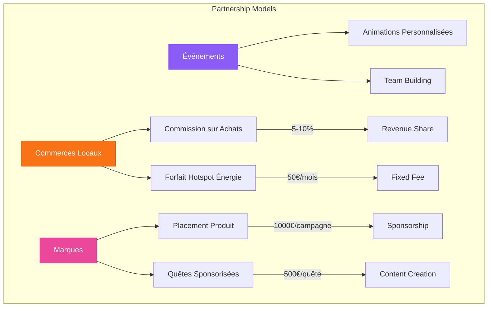
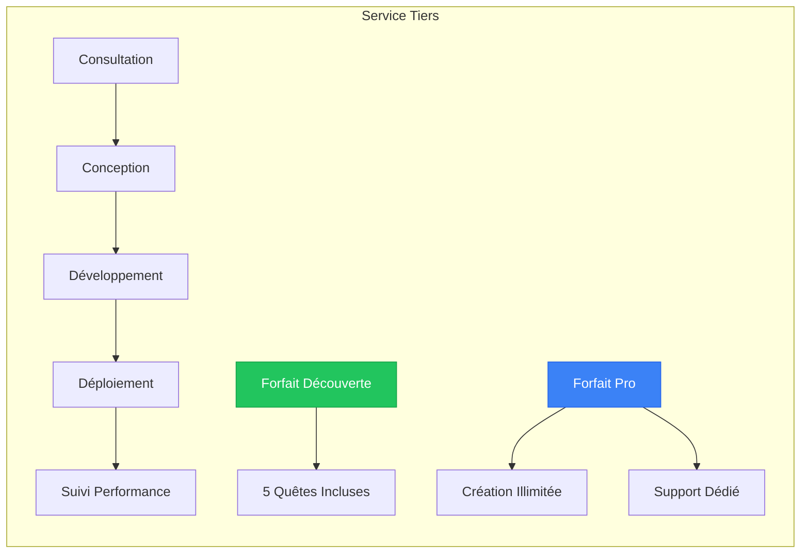
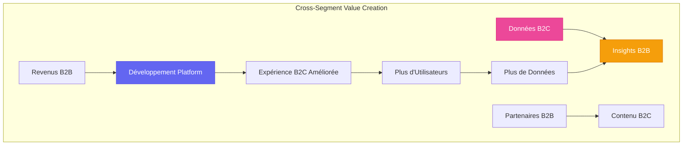
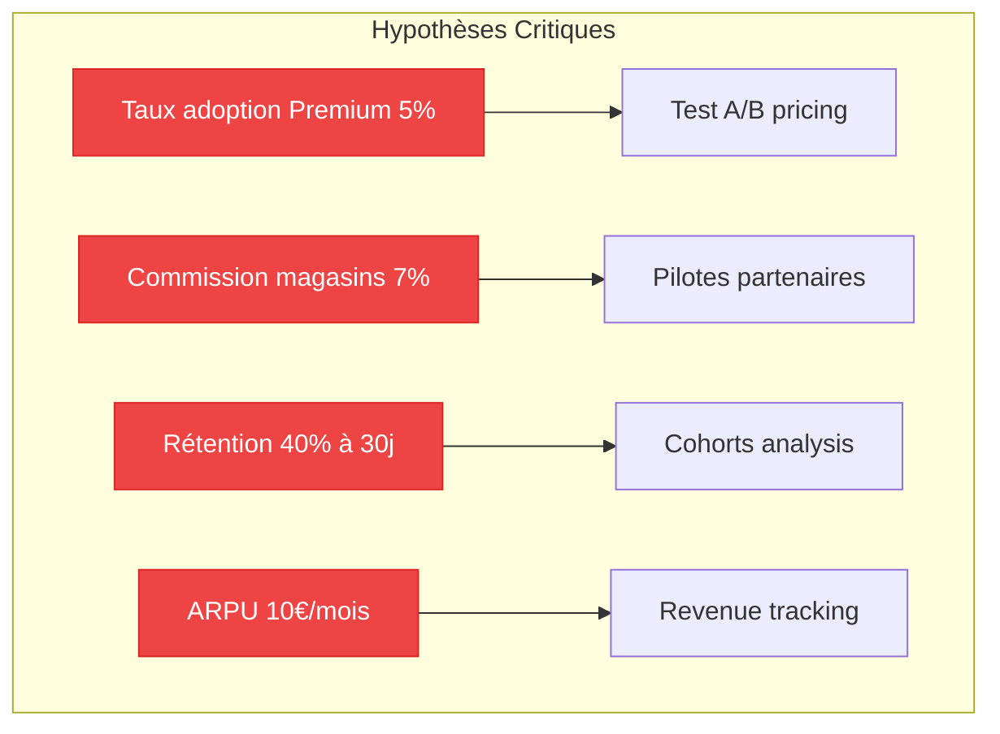

# Business Model Lootopia

## Vue d'ensemble

Lootopia adopte un modèle économique hybride combinant les segments B2B et B2C, avec une monétisation basée sur la gamification, les services de données et l'accompagnement personnalisé.

## Segment B2C - Utilisateurs Finaux

### Modèle Freemium avec Abonnements

### Structure Tarifaire B2C

| Niveau       | Prix        | Fonctionnalités                                                                        | Revenus Publicitaires   |
| ------------ | ----------- | -------------------------------------------------------------------------------------- | ----------------------- |
| **Gratuit**  | 0€          | • Quêtes de base • 50 couronnes/mois • Artefacts standards                       | Oui (bannières, vidéos) |
| **Premium**  | 9,99€/mois  | • Quêtes illimitées • 200 couronnes/mois • Artefacts premium • XP x2          | Non                     |
| **Premium+** | 19,99€/mois | • Tout Premium • 500 couronnes/mois • Création de quêtes • Classements privés | Non                     |

### Microtransactions et Marketplace

**Taux de conversion :**

- 1€ = 100 couronnes
- Frais de transaction marketplace : 5%
- Commission sur revente d'artefacts : 10%

---

## 🏢 Segment B2B - Entreprises et Partenaires

### Offre Data & Analytics

**Services Data B2B :**

| Service             | Description                                    | Tarification  |
| ------------------- | ---------------------------------------------- | ------------- |
| **Analytics Basic** | Dashboard temps réel, métriques d'engagement   | 299€/mois     |
| **Analytics Pro**   | + Rapports personnalisés, segmentation avancée | 599€/mois     |
| **Data API**        | Accès API aux données anonymisées              | 0,10€/requête |
| **Custom Reports**  | Rapports sur mesure, consultation expert       | 150€/rapport  |

### Partenariats Commerciaux

### Accompagnement à la Création de Quêtes

**Tarification Services B2B :**

| Package        | Prix       | Inclus                           | Cible                |
| -------------- | ---------- | -------------------------------- | -------------------- |
| **Starter**    | 1 500€     | 5 quêtes, formation 2h           | PME, associations    |
| **Business**   | 5 000€     | 20 quêtes, support 6 mois        | Moyennes entreprises |
| **Enterprise** | 15 000€    | Quêtes illimitées, support dédié | Grandes entreprises  |
| **À la quête** | 300€/quête | Création ponctuelle              | Projets ponctuels    |

---

## 🔄 Synergies B2B/B2C

**Points d'intersection clés :**

- **Data Loop** : Les données B2C alimentent les services B2B
- **Content Loop** : Les partenaires B2B créent du contenu pour les utilisateurs B2C
- **Revenue Loop** : Les revenus B2B financent l'amélioration de l'expérience B2C

---

## 📊 Projections et Métriques Clés

### KPIs B2C

- **ARPU** (Average Revenue Per User) : 8-12€/mois
- **Taux de conversion Freemium → Premium** : 5-8%
- **Rétention à 30 jours** : 40%
- **Lifetime Value (LTV)** : 150€

### KPIs B2B

- **Contract Value Moyen** : 3 500€
- **Taux de renouvellement** : 85%
- **Acquisition Cost** : 500€
- **Temps de payback** : 6 mois

### Hypothèses à Valider

**Prochaines étapes de validation :**

1. **MVP Test** : Valider la conversion Freemium avec 1000 utilisateurs
2. **Pilot B2B** : 5 partenaires commerciaux pour tester le modèle commission
3. **Retention Study** : Analyser les comportements d'engagement sur 3 mois
4. **Pricing Optimization** : Tests A/B sur les tiers d'abonnement
