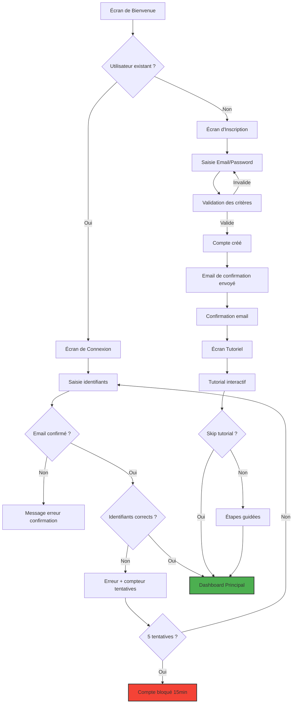
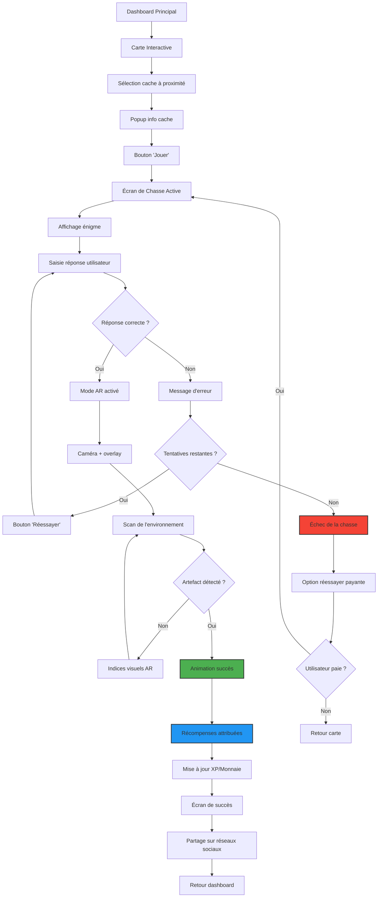
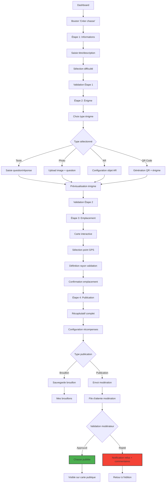
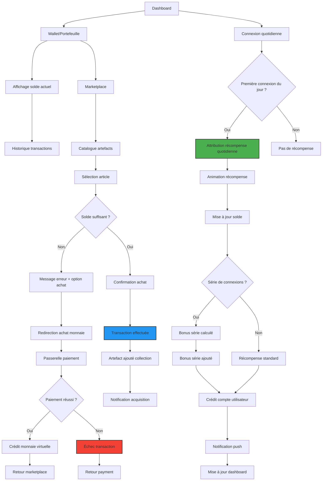

# PRD - Lootopia Platform

## Product Requirements Document

**Version :** 1.0  
**Date :** 30 Juin 2025  
**Équipe Produit :** Lootopia Team

---

## 🎯 **EXECUTIVE SUMMARY**

### Vision Produit

Lootopia est une plateforme immersive de chasse au trésor numérique combinant réalité augmentée, géolocalisation et économie virtuelle. Elle permet aux joueurs d'explorer des mondes riches en énigmes et aux organisateurs de créer des aventures personnalisées.

### Objectifs Business

- Créer une communauté active de chasseurs de trésors numériques
- Proposer une plateforme B2B pour les marques et événements
- Développer une économie virtuelle durable avec artefacts NFT
- Atteindre 100K utilisateurs actifs dans les 12 premiers mois

### Public Cible

- **Primaire** : Joueurs 18-35 ans, technophiles, amateurs d'escape games
- **Secondaire** : Entreprises cherchant à gamifier leurs événements
- **Tertiaire** : Familles pour activités loisirs géolocalisées

---

## 📱 **ARCHITECTURE PRODUIT**

### Plateforme Multi-Canal

- **Mobile App** (iOS/Android) : Expérience de jeu principale
- **Web App** : Dashboard créateurs et partenaires B2B
- **AR Module** : Intégration réalité augmentée native

### Stack Technique Recommandé

- **Frontend Mobile** : React Native ou Flutter
- **Frontend Web** : Next.js avec React
- **Backend** : Node.js avec microservices
- **Base de données** : PostgreSQL + PostGIS (géolocalisation)
- **AR** : ARKit (iOS) / ARCore (Android)
- **Notifications** : Firebase Cloud Messaging

---

## 🗺️ **USER FLOWS PRINCIPAUX**

### User Flow 1 : Authentification et Onboarding

### User Flow 2 : Découverte et Jeu de Chasse

### User Flow 3 : Création de Chasse

### User Flow 4 : Économie Virtuelle et Récompenses

---

## 📱 **SPÉCIFICATIONS DÉTAILLÉES DES ÉCRANS**

### Écran 1 : Dashboard Principal

**Composants UI :**

- Header avec avatar, solde, notifications, XP
- Card récompense quotidienne avec animation flame
- Section "Chasses à proximité" (carousel horizontal)
- FAB (Floating Action Button) "Créer chasse"
- Bottom navigation (5 onglets)

**Fonctionnalités :**

- Géolocalisation automatique
- Notifications push contextuelles
- Actualisation pull-to-refresh
- Cache local pour mode hors-ligne

**Critères d'acceptation :**

- [ ] Le solde se met à jour en temps réel après transactions
- [ ] Les chasses à proximité se filtrent par rayon configurable (500m par défaut)
- [ ] La récompense quotidienne n'apparaît qu'une fois par jour
- [ ] Le niveau XP se calcule automatiquement selon paliers définis

### Écran 2 : Carte Interactive

**Composants UI :**

- Carte plein écran avec MapBox/Google Maps
- Marqueurs différenciés par difficulté (couleurs/icônes)
- Popup d'information au tap sur marqueur
- Filtres flottants (difficulté, type, distance)
- Bouton géolocalisation (bottom-right)

**Fonctionnalités :**

- Clustering automatique des marqueurs proches
- Chargement progressif selon zoom level
- Mode hors-ligne avec cartes pré-téléchargées
- Navigation vers GPS externe (Google Maps/Waze)

**Critères d'acceptation :**

- [ ] La carte charge en moins de 3 secondes
- [ ] Les marqueurs s'affichent jusqu'à 10km de rayon
- [ ] Le clustering fonctionne pour plus de 50 marqueurs visibles
- [ ] La géolocalisation a une précision < 10 mètres

### Écran 3 : Chasse Active - Mode Normal

**Composants UI :**

- Header avec titre chasse et progression
- Card énigme avec formatage riche (texte/image/audio)
- Champ de réponse avec suggestions
- Boutons d'action (Valider, Indice, Passer)
- Timer optionnel pour chasses chronométrées

**Fonctionnalités :**

- Validation réponse case-insensitive configurable
- Système d'indices progressifs (payants)
- Sauvegarde automatique progression
- Mode spectateur pour chasses en équipe

**Critères d'acceptation :**

- [ ] La validation de réponse se fait en moins de 1 seconde
- [ ] Les indices se débloquent séquentiellement
- [ ] La progression se sauvegarde toutes les 10 secondes
- [ ] Le timer fonctionne même en arrière-plan

### Écran 4 : Chasse Active - Mode AR

**Composants UI :**

- Caméra temps réel plein écran
- Overlay avec instructions et aide
- Crosshair/réticule de visée
- Boutons capture et retour mode normal
- Indicateurs de détection (vibration/audio)

**Fonctionnalités :**

- Reconnaissance d'objets via ML/AI
- Tracking spatial pour objets 3D
- Mode nuit avec amélioration contraste
- Enregistrement vidéo pour replay

**Critères d'acceptation :**

- [ ] La caméra AR s'initialise en moins de 2 secondes
- [ ] La détection d'objets fonctionne à 2 mètres minimum
- [ ] Le tracking 3D reste stable pendant mouvement
- [ ] Le mode nuit améliore visibilité de 40%

### Écran 5 : Créateur de Chasse - Multi-étapes

**Étape 1 - Informations :**

- Stepper horizontal avec progression
- Champs titre (50 caractères max) et description (500 max)
- Sélecteur difficulté avec preview
- Tags/catégories multiples
- Upload image de couverture

**Étape 2 - Énigme :**

- Templates prédéfinis par type
- Éditeur riche pour formatage texte
- Upload média (image/audio/vidéo)
- Configuration réponses multiples
- Prévisualisation temps réel

**Étape 3 - Emplacement :**

- Carte interactive avec recherche
- Sélection précise par crosshair
- Configuration rayon validation (5-50m)
- Prévisualisation zone sur carte
- Validation accessibilité lieu public

**Étape 4 - Publication :**

- Récapitulatif complet éditable
- Configuration récompenses (XP/monnaie/artefacts)
- Options visibilité (publique/privée/événement)
- Soumission pour modération
- Planification publication différée

**Critères d'acceptation :**

- [ ] Sauvegarde automatique à chaque étape
- [ ] Possibilité retour étape précédente sans perte
- [ ] Validation des champs obligatoires en temps réel
- [ ] Prévisualisation complète avant soumission

### Écran 6 : Profil Utilisateur

**Section Identité :**

- Avatar grande taille avec upload photo
- Nom utilisateur éditable (unique)
- Niveau et progression XP détaillée
- Date inscription et dernière activité

**Section Statistiques :**

- Graphiques d'activité (7/30 jours)
- Métriques : chasses complétées, créées, distance
- Palmarès et records personnels
- Comparaison avec amis/communauté

**Section Collections :**

- Galerie badges avec descriptions
- Artefacts par rareté et valeur
- Historique détaillé des chasses
- Partage sur réseaux sociaux

**Critères d'acceptation :**

- [ ] L'avatar se met à jour immédiatement après upload
- [ ] Les statistiques se calculent en temps réel
- [ ] Les graphiques supportent zoom et filtres
- [ ] Le partage fonctionne sur 5 réseaux minimum

### Écran 7 : Wallet et Économie

**Section Solde :**

- Affichage solde principal avec icône
- Graphique évolution 30 jours
- Boutons achat et historique
- Conversion taux réel optionnelle

**Section Transactions :**

- Liste chronologique paginée
- Filtres par type et période
- Recherche par montant/description
- Export CSV/PDF pour historique

**Section Marketplace :**

- Grid d'artefacts avec tri/filtres
- Système d'enchères pour objets rares
- Wishlist et alertes prix
- Évaluations vendeurs/acheteurs

**Critères d'acceptation :**

- [ ] Le solde se synchronise en moins de 5 secondes
- [ ] L'historique charge par batches de 50 transactions
- [ ] Les enchères se mettent à jour en temps réel
- [ ] Les paiements sont sécurisés PCI-DSS

---

## 🔧 **SPÉCIFICATIONS TECHNIQUES**

### Performance

- **Temps de chargement** : < 3 secondes sur 4G
- **Fluidité AR** : 30 FPS minimum, 60 FPS optimal
- **Géolocalisation** : Précision < 5 mètres en zone urbaine
- **Offline** : Fonctionnalités core disponibles sans réseau

### Sécurité

- **Authentification** : JWT avec refresh tokens
- **Données** : Chiffrement AES-256 en transit et repos
- **API** : Rate limiting et protection DDOS
- **Paiements** : Conformité PCI-DSS niveau 1

### Scalabilité

- **Architecture** : Microservices containerisés
- **Database** : Sharding automatique selon géolocation
- **CDN** : Distribution mondiale des assets statiques
- **Monitoring** : Alertes temps réel sur métriques clés

### Compatibilité

- **iOS** : 14.0+ (95% du parc utilisateur)
- **Android** : API 26+ / Android 8.0 (90% du parc)
- **Web** : Chrome 88+, Safari 14+, Firefox 85+
- **AR** : ARKit 4.0+, ARCore 1.20+

---

## 📊 **MÉTRIQUES ET ANALYTICS**

### KPIs Engagement

- **DAU/MAU** : Utilisateurs actifs quotidiens/mensuels
- **Session Duration** : Temps moyen par session
- **Retention Rate** : Rétention J1, J7, J30
- **Churn Rate** : Taux d'abandon mensuel

### KPIs Monétisation

- **ARPU** : Revenu moyen par utilisateur
- **LTV** : Valeur vie client
- **Conversion Rate** : Freemium vers premium
- **Transaction Volume** : Volume économie virtuelle

### KPIs Technique

- **Crash Rate** : < 0.1% des sessions
- **API Response Time** : P95 < 500ms
- **App Store Rating** : > 4.5/5 étoiles
- **Support Ticket Volume** : < 2% utilisateurs actifs

---

## 🚀 **ROADMAP ET PRIORISATION**

### Phase 1 - MVP (Mois 1-3)

**Must Have :**

- Authentification complète
- Créateur de chasse basique
- Carte et géolocalisation
- Système de récompenses
- Wallet simple

### Phase 2 - Gamification (Mois 4-6)

**Should Have :**

- Mode AR complet
- Système de niveaux avancé
- Marketplace artefacts
- Dashboard analytics B2B
- Notifications push

### Phase 3 - Social & Scale (Mois 7-12)

**Could Have :**

- Fonctionnalités sociales
- Événements communautaires
- API partenaires
- Mode multijoueur
- Blockchain/NFT integration

---

## ✅ **CRITÈRES D'ACCEPTATION GLOBAUX**

### Fonctionnel

- [ ] 100% des user stories MVP implémentées
- [ ] Tests d'acceptation automatisés passent
- [ ] Interface responsive sur tous écrans
- [ ] Mode offline fonctionnel pour features core

### Technique

- [ ] Code coverage > 80%
- [ ] Performance tests validés
- [ ] Sécurité audit complété
- [ ] Documentation technique à jour

### Business

- [ ] Validation utilisateurs beta (>4.0/5)
- [ ] Métriques performance atteintes
- [ ] Budget respecté (+/- 10%)
- [ ] Timeline respectée (livraison Q4 2025)

---

**Document approuvé par :**

- Product Owner : [Nom]
- Tech Lead : [Nom]
- UX Designer : [Nom]
- Stakeholder Business : [Nom]

_Dernière mise à jour : 30 Juin 2025_
