# Userflow Global - LOOTOPIA

```mermaid
flowchart LR
    Start([Début]) --> Discovery{Découverte de LOOTOPIA}

    %% AWARENESS - Découverte
    Discovery -->|Alexandre - Instagram pub| AlexSocial[Voit pub Instagram<br/>avec RA]
    Discovery -->|Thomas - Réseaux sociaux| ThomasSocial[Voit stories amis<br/>sur réseaux]
    Discovery -->|Marie - Salon professionnel| MarieSalon[Assiste salon<br/>Tourisme Innovation]

    %% Page principale
    AlexSocial --> WebsitePage[Page site web]
    ThomasSocial --> WebsitePage
    MarieSalon --> CommercialContact[Contact commercial]

    %% CONSIDERATION
    WebsitePage --> AppDownload[Télécharge app]
    CommercialContact --> MarieEval{Marie évalue solution?}
    MarieEval -->|Oui| MariePresentation[Reçoit présentation<br/>détaillée]
    MarieEval -->|Non| End1([Fin])

    %% ACQUISITION - Première utilisation
    AppDownload --> AccountCreation[Création compte]
    MariePresentation --> MarieBudget[Élabore dossier<br/>budget]

    AccountCreation --> OnboardingPage[Page tutoriel/onboarding]
    MarieBudget --> ContractDecision{Décision contrat?}
    ContractDecision -->|Oui| ContractSigning[Signature contrat]
    ContractDecision -->|Non| End2([Fin])

    %% Choix de parcours
    OnboardingPage --> ChooseHunt[Choisir chasse au trésor]
    ContractSigning --> ContentCreation[Création contenu<br/>avec équipe locale]

    %% SERVICE - Expérience utilisateur
    ChooseHunt --> MapPage[Page carte interactive]
    ContentCreation --> TestPhase[Phase de test<br/>avec influenceurs]

    MapPage --> HuntExperience[Expérience chasse]
    HuntExperience --> ARInteraction[Interaction RA<br/>sur bâtiments]
    ARInteraction --> SolveEnigma[Résolution énigmes]
    SolveEnigma --> EarnPoints[Gagner points]
    EarnPoints --> PartnerReward[Récompense partenaire]
    PartnerReward --> SocialShare[Partage sur réseaux]

    TestPhase --> LaunchCampaign[Campagne de lancement]
    LaunchCampaign --> PublicLaunch[Lancement public]

    %% Résultats et performance
    SocialShare --> ResultsPage[Page résultats/score]
    ResultsPage --> CommunityJoin{Rejoindre communauté?}
    CommunityJoin -->|Oui| CommunityPage[Page communauté]
    CommunityJoin -->|Non| ShareDecision{Partager expérience?}

    PublicLaunch --> AnalyticsReview[Analyse résultats<br/>3 mois]

    %% CONVERSION - Monétisation et engagement
    CommunityPage --> PremiumDecision{S'abonner premium?}
    ShareDecision -->|Oui| CreateOwnHunt[Créer sa propre chasse]
    ShareDecision -->|Non| End3([Fin])

    PremiumDecision -->|Oui| SubscriptionPage[Page abonnement]
    PremiumDecision -->|Non| FreeContent[Contenu gratuit limité]

    CreateOwnHunt --> CreationToolsPage[Page outils création]
    SubscriptionPage --> PremiumContent[Accès contenu premium]

    AnalyticsReview --> ExpansionDecision{Étendre partenariat?}
    ExpansionDecision -->|Oui| NewContract[Nouveau contrat<br/>parcours supplémentaires]
    ExpansionDecision -->|Non| BasicPartnership[Partenariat de base]

    %% LOYALTY - Fidélisation
    PremiumContent --> WeeklyChallenge[Défis hebdomadaires]
    CreationToolsPage --> MarketplaceShare[Partage sur marketplace]
    NewContract --> EventPlanning[Planification événements]

    WeeklyChallenge --> Leaderboard[Classements]
    MarketplaceShare --> CommunityRecognition[Reconnaissance communautaire]
    EventPlanning --> DestinationPromotion[Promotion destination]

    Leaderboard --> InviteFriends[Inviter amis]
    CommunityRecognition --> AmbassadorStatus[Statut ambassadeur]
    DestinationPromotion --> TourismImpact[Impact touristique mesuré]

    InviteFriends --> GroupHunts[Chasses en groupe]
    AmbassadorStatus --> AdvancedFeatures[Fonctionnalités avancées]
    TourismImpact --> LongTermPartnership[Partenariat long terme]

    %% Couleurs par persona
    classDef alexandre fill:#FF6B6B,stroke:#FF4444,stroke-width:2px,color:#fff
    classDef thomas fill:#4ECDC4,stroke:#26B5AA,stroke-width:2px,color:#fff
    classDef marie fill:#45B7D1,stroke:#2196F3,stroke-width:2px,color:#fff
    classDef shared fill:#95E1D3,stroke:#26A69A,stroke-width:2px,color:#333

    %% Application des couleurs Alexandre (rouge)
    class AlexSocial,AppDownload,AccountCreation,OnboardingPage,ChooseHunt,MapPage,HuntExperience,ARInteraction,SolveEnigma,EarnPoints,PartnerReward,SocialShare,ResultsPage,CommunityPage,PremiumDecision,SubscriptionPage,PremiumContent,WeeklyChallenge,Leaderboard,InviteFriends,GroupHunts alexandre

    %% Application des couleurs Thomas (bleu-vert)
    class ThomasSocial,CommunityJoin,ShareDecision,CreateOwnHunt,CreationToolsPage,MarketplaceShare,CommunityRecognition,AmbassadorStatus,AdvancedFeatures thomas

    %% Application des couleurs Marie (bleu)
    class MarieSalon,CommercialContact,MarieEval,MariePresentation,MarieBudget,ContractDecision,ContractSigning,ContentCreation,TestPhase,LaunchCampaign,PublicLaunch,AnalyticsReview,ExpansionDecision,NewContract,EventPlanning,DestinationPromotion,TourismImpact,LongTermPartnership marie

    %% Éléments partagés
    class WebsitePage,Discovery,Start,FreeContent,BasicPartnership shared
```

## Légende des couleurs

- 🔴 **Alexandre** (Rouge) - Jeune explorateur urbain, early adopter technophile
- 🔵 **Marie** (Bleu) - Directrice office de tourisme, approche B2B professionnelle
- 🟢 **Thomas** (Bleu-vert) - Organisateur social, créateur de contenu communautaire
- 🟢 **Éléments partagés** (Vert clair) - Actions communes à tous les personas

## Types d'éléments

### Actions

- Télécharger app, créer compte, choisir parcours
- Résoudre énigmes, scanner QR codes, partager sur réseaux
- S'abonner premium, créer contenu, rejoindre communauté

### Conditions (décisions)

- Évaluer solution, décider contrat, s'abonner premium
- Rejoindre communauté, partager expérience, étendre partenariat

### Pages principales

- Site web, page carte interactive, page communauté
- Page résultats, page abonnement, outils création
- Page tutoriel/onboarding, marketplace
