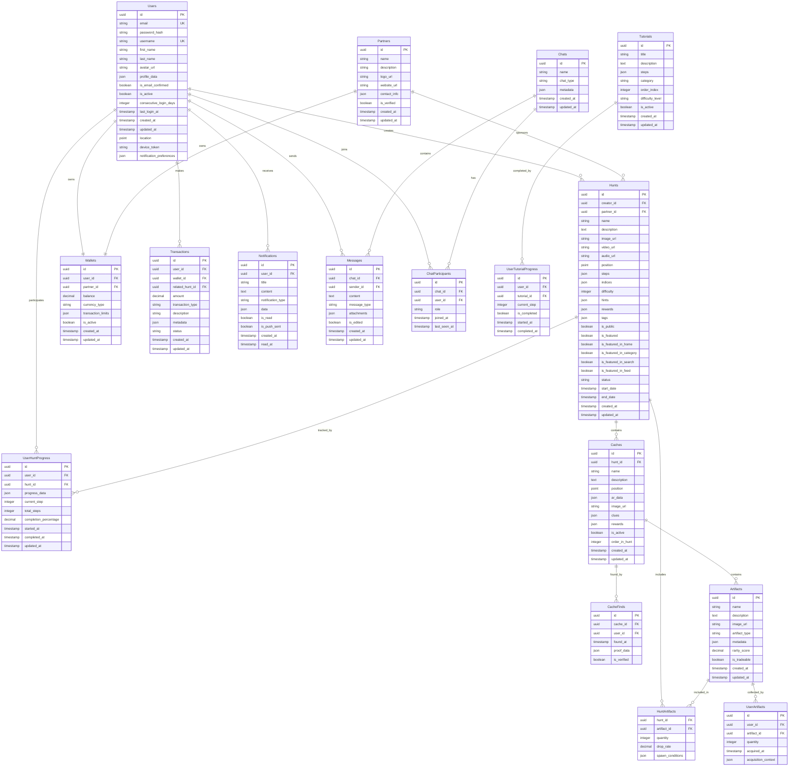

# Document technique

## Stack Technique

- Next.js pour le front web
- React Native pour le mobile
- AdonisJS pour les microservices backend
- PostgreSQL pour la base de données principale
- Redis pour le cache et la gestion des sessions
- AWS/GCP pour l'infrastructure cloud
- ARKit/ARCore pour la Réalité Augmentée
- Stripe pour la gestion de la monnaie virtuelle
- Docker pour le conteneurisation
- Github Actions pour la CI/CD
- OpenAI pour l'IA

## Argumentation des hypothèses prises pour le projet

## Base de données

Ce diagramme représente la structure complète de la base de données pour la plateforme Lootopia, une application de chasse au trésor numérique avec réalité augmentée et économie virtuelle.



## Descriptions des entités principales

### Users

Table centrale des utilisateurs avec profil complet, géolocalisation et préférences de notifications.

### Hunts (Chasses)

Entité principale représentant les chasses au trésor créées par les utilisateurs ou partenaires.

### Caches

Points d'intérêt géolocalisés dans les chasses, avec données AR et récompenses.

### Wallets

Système de portefeuille virtuel pour l'économie du jeu.

### Transactions

Historique complet des mouvements de monnaie virtuelle.

### Artifacts

Objets collectibles avec système de rareté et échangeabilité.

## Index recommandés

```sql
-- Performance pour les requêtes géospatiales
CREATE INDEX idx_users_location ON Users USING GIST (location);
CREATE INDEX idx_hunts_position ON Hunts USING GIST (position);
CREATE INDEX idx_caches_position ON Caches USING GIST (position);

-- Performance pour les recherches
CREATE INDEX idx_hunts_creator_status ON Hunts (creator_id, status);
CREATE INDEX idx_hunts_featured ON Hunts (is_featured, is_public);
CREATE INDEX idx_transactions_user_date ON Transactions (user_id, created_at DESC);
CREATE INDEX idx_notifications_user_unread ON Notifications (user_id, is_read);

-- Full-text search
CREATE INDEX idx_hunts_search ON Hunts USING GIN (to_tsvector('french', name || ' ' || description));
```

## Contraintes importantes

- `Users.email` et `Users.username` doivent être uniques
- `Wallets.balance` ne peut pas être négatif
- `Hunts.start_date` doit être antérieur à `end_date`
- `UserHuntProgress.completion_percentage` entre 0 et 100
- `Artifacts.rarity_score` entre 0 et 1

## Évolutivité

Ce modèle est conçu pour supporter :

- L'ajout de nouveaux types d'artefacts et récompenses via JSON
- L'intégration AR avec métadonnées flexibles
- Le système de blockchain/NFT via les champs metadata
- La géolocalisation haute performance avec PostGIS
- Les notifications push multicanal
